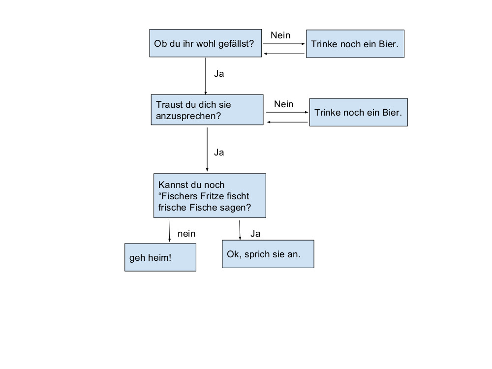

# Anhang: Einstieg in Python

Die grundlegenden Strukturen einer Programmiersprache lassen sich auch ganz gut anhand von Entscheidungsdiagrammen erläutern. Für das folgende Diagramm soll ein Programm geschrieben werden.



