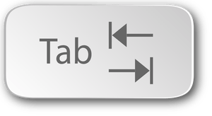

# Das erste Programm

### Das erste Programm

Bevor du mit dem Programmieren beginnen kannst, musst du zunächst deinen Roboter über den Computer mit dem Internet verbinden. Dieser [Link](https://www.ev3dev.org/docs/tutorials/connecting-to-the-internet-via-usb/) führt zu einer Anleitung, wie dies mit Hilfe eines USB Kabels geschehen kann. Hierbei ist noch zu beachten, dass du auf den Schulrechnern den Netzwerk- Verbindungseditor mit dem Befehl

```bash
gksudo nm-connection-editor
```

starten musst. Nachdem du die Netzwerkverbindung aufgesetzt hast musst du über [ssh](https://www.ev3dev.org/docs/tutorials/connecting-to-ev3dev-with-ssh/) ein Terminal auf dem Computer des Roboters öffnen. Bevor du dies tust, solltest du dich nochmal vergewissern, dass sich der Roboter im Modus `Online`befindet. Um den Quellcode für dein  erstes Python Programm zu erstellen, ist es nun am einfachsten den Texteditor Nano, der keine grafische Benutzeroberfläche benötigt, auf dem Roboter zu starten. Mit dem Befehl 

```bash
nano erstesprog.py 
```

erzeugst du dabei gleichzeitig eine Textdatei mit Namen erstesprog.py.



Schreibe nun folgenden Text \(Code\) in die Datei:

```python
#!/usr/bin/env python3

from ev3dev.ev3 import *
from time import sleep
m1 = LargeMotor('outA')
m2 = LargeMotor('outB')
m1.run_forever(speed_sp=900)
m2.run_forever(speed_sp=900)
sleep(4)
m1.stop(stop_action="hold")
m2.stop(stop_action="hold")

```

Mit `Strg+o`und [anschließend](https://www.ev3dev.org/docs/tutorials/connecting-to-ev3dev-with-ssh/) `Enter` speicherst du den Text \(Code\) und mit `Strg+x` Verlässt du Nano und kannst mit

```bash
python3 firstprog.py
```

das Programm im Terminal starten. Die Nano Tastaturbefehle werden zum Glück in der unteren Zeile angezeigt, wobei zu beachten ist, dass mit `^` die `Strg` Taste gemeint ist. Falls du beim Tippen einen Fehler gemacht hast, wird dir dies vom Python Interpreter, der deinen Code Schritt für Schritt interpretiert, angezeigt. Achte vor allem auf die erste Nummer der Textzeile, in der ein Fehler auftritt. Beim wiederholten verbessern und Ausprobieren deines Codes ist es wichtig, dass du die bereits eingetippten Befehle mit den Pfeiltasten wieder aufrufen kannst. Die Bedeutungen der Befehle im ersten Programm sollen nun schrittweise besprochen werden.  

`#!/usr/bin/env python3` : Diese Zeile hat zur Folge, dass man das Programm auch ohne USB Kabel vom Roboter aus starten kann.  

 

