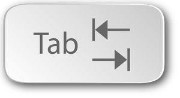

# Schleifen

#### Auf der Stelle drehen

um den Roboter auf der Stelle drehen zu lassen, verwendest du einfach folgenden Codeschnipsel

```python
#!/usr/bin/env python3

from ev3dev.ev3 import *
from time import sleep
m1 = LargeMotor('outB')
m2 = LargeMotor('outA')

m1.run_to_rel_pos(position_sp=360, speed_sp=500,stop_action="hold")
m2.run_to_rel_pos(position_sp=-360, speed_sp=500,stop_action="hold")
m1.wait_while('running')

```

**Aufgabe:** Ändere den Codeschnipsel so ab, dass der Roboter sich um 90° dreht ****

#### Ein Quadrat fahren

Um den Roboter ein Quadrat fahren zu lassen, könnte man geneigt sein, folgenden Code zu verwenden

```python
#!/usr/bin/env python3

from ev3dev.ev3 import *
from time import sleep
m1 = LargeMotor('outB')
m2 = LargeMotor('outA')

m1.run_to_rel_pos(position_sp=360, speed_sp=500,stop_action="hold")
m2.run_to_rel_pos(position_sp=360, speed_sp=500,stop_action="hold")
m1.wait_while('running')
m1.run_to_rel_pos(position_sp=180, speed_sp=500,stop_action="hold")
m2.run_to_rel_pos(position_sp=-180, speed_sp=500,stop_action="hold")
m1.wait_while('running')
m1.run_to_rel_pos(position_sp=360, speed_sp=500,stop_action="hold")
m2.run_to_rel_pos(position_sp=360, speed_sp=500,stop_action="hold")
m1.wait_while('running')
m1.run_to_rel_pos(position_sp=180, speed_sp=500,stop_action="hold")
m2.run_to_rel_pos(position_sp=-180, speed_sp=500,stop_action="hold")
m1.wait_while('running')
m1.run_to_rel_pos(position_sp=360, speed_sp=500,stop_action="hold")
m2.run_to_rel_pos(position_sp=360, speed_sp=500,stop_action="hold")
m1.wait_while('running')
m1.run_to_rel_pos(position_sp=180, speed_sp=500,stop_action="hold")
m2.run_to_rel_pos(position_sp=-180, speed_sp=500,stop_action="hold")
m1.wait_while('running')
m1.run_to_rel_pos(position_sp=360, speed_sp=500,stop_action="hold")
m2.run_to_rel_pos(position_sp=360, speed_sp=500,stop_action="hold")
m1.wait_while('running')
```

Wie du siehst ist dies ein Text, der dadurch lang wird, dass er sich wiederholt. Um dies zu automatisieren gibt es in den meisten Programmiersprachen das Grundelement der Schleife. In Python sieht das so aus:

```python
#!/usr/bin/env python3

from ev3dev.ev3 import *
from time import sleep
m1 = LargeMotor('outB')
m2 = LargeMotor('outA')

for i in range(0,4):
        m1.run_to_rel_pos(position_sp=720, speed_sp=500,stop_action="hold")
        m2.run_to_rel_pos(position_sp=720, speed_sp=500,stop_action="hold")
        m1.wait_while('running')
        m1.run_to_rel_pos(position_sp=180, speed_sp=500,stop_action="hold")
        m2.run_to_rel_pos(position_sp=-180, speed_sp=500,stop_action="hold")
        m1.wait_while('running')
```

**Aufgabe:** Lass das Programm auch mit auskommentiertem `m1.wait_while('running')` Befehl laufen und überlege dir warum dieser wichtig ist.

**Erklärung zur Schleife:**  Der Buchstabe `i` ist eine Variable, die den Bereich durchläuft, der durch `range(0,4)` angegeben ist. `i` startet also bei 0 und endet bei 3 d.h. bei der letzten Zahl, die kleiner als die zweite Grenze im `range` Befehl ist. Für jeden Wert von i werden dann die Befehle durchlaufen, die unter der  "`for i in range(0,4):`"  Zeile eingerückt sind. Die Einrückung dient hier also nicht nur der Übersichtlichkeit des Quelltextes, sondern hat in Python eine sehr wichtige Bedeutung. Die Einrückung erzeugst du in Nano mit der Tabulatortaste      und **nicht** mit Leerzeichen!


