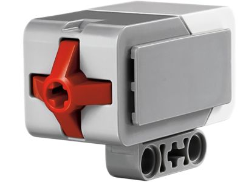
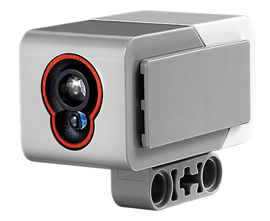
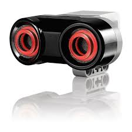
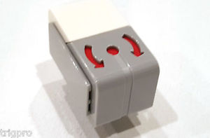

# Sensoren

### Der Tastsensor

Der Roboter soll jetzt auf Hindernisse reagieren können. Hierzu musst du zunächst einen Tastsensor anbauen, der nach vorne zeigt. Wird dieser gedrückt, so weiß der Roboter, dass er irgendwo angestoßen ist. An dem Tastsensor solltest du noch eine selbst entworfene Konstruktion anbringen, um zu gewährleisten, dass der Knopf beim anstoßen auch tatsächlich gedrückt wird.


Während Motoren mit den Ausgängen A-D verbunden werden, sind die mit Zahlen versehenen Ausgänge 1-4 für Sensoren gedacht.  


Hier ein selbsterklärendes Beispiel für die Verwendung des Berührungssensors. Starte das Programm ohne USB Verbindung vom Roboter. 


Die Datei des Programms muss vorher einmal mit `chmod +x dateiname` ausführbar gemacht werden.



Da sich das Programm in einer Endlosschleife befindet, musst du es durch langes Drücken der grauen "zurück" Taste oben links beenden.


```python
#!/usr/bin/env python3

from ev3dev.ev3 import *
from time import sleep

m1 = LargeMotor('outB')
m2 = LargeMotor('outA')

ts = TouchSensor()
# ein Beruehrungssensorobjekt wird erzeugt 
assert ts.connected, "Verbinde einen Ber  hrungssensor mit irgend einem Eingang$
# falls kein Sensor vorhanden ist wird eine Fehlermeldung ausgegeben 
# und das Programm beendet
while True: #Endlosschleife da die Bedingung immer wahr ist
        m1.run_forever(speed_sp=700)
        m2.run_forever(speed_sp=700)
        if ts.value()==True:
                m1.stop()
                m2.stop()
                Sound.speak('Hello my name is E V 3').wait()#Dieser Befehl laes$
                sleep(2)
                m1.run_forever(speed_sp=-700)
                m2.run_forever(speed_sp=-700)
                sleep(1) #fahre fuer 1 Sekunde rueckwaerts
                
```

**Aufgabe:** Ergänze obiges Programm, so dass sich der Roboter nach seiner Rückwärtsfahrt um einen zufälligen Winkel zwischen 0° und 720° dreht. 

### Der Lichtsensor  

Sensoren sind Fühler, wie für uns Menschen die Augen, die Ohren oder die Hände, mit denen der Roboter sehen, hören und tasten kann. Das tolle an unserem Lego Roboter ist, dass wir mehrere Sensoren an ihm anschließen können, und dass wir den Roboter auf die Sensoren reagieren lassen können. Bevor wir mit dem Einbinden von Sensoren in ein Python Programm beginnen können, müssen wir unseren Roboter etwas umbauen, indem wir zwei Lichtsensoren hinzufügen. Folge zu diesem Zweck der Bauanleitung ab Seite 47. Füge in entsprechender Weise auch den 2. Lichtsensor hinzu.

```python
#!/usr/bin/env python3

from ev3dev.ev3 import *
from time import sleep

mb = LargeMotor('outB')#Die Motoren sind an den Ausgngen B und  C
mc = LargeMotor('outA')

cl1= ColorSensor('in4')# die Lichtsensoren sind an den Ausgngen 4 und 2 
cl2=ColorSensor('in1')

cl1.mode='COL-REFLECT' #in diesem Modus misst der Lichtsensor die reflektierte $
cl2.mode='COL-REFLECT'

while True:
        mb.run_forever(speed_sp=500)
        mc.run_forever(speed_sp=500)

        if cl1.value() < 20 or cl2.value() < 20 :
                mb.stop(stop_action="hold")
                mc.stop(stop_action="hold")
                Sound.speak('Oh shit').wait()
                mb.run_forever(speed_sp=-500)
                mc.run_forever(speed_sp=-500)
                sleep(1)

```

Der Lichtsensor hat verschiedene Modi und kann auch Farbe wahrnehmen. In obigem Beispiel misst er einfach die Stärke des reflektierten Lichtes, das er selbst aussendet. 


Daher darf er nicht zu nah am Boden angebracht werden.


Um den Schwellenwert des Lichtsensors in einer `if` Anweisung an die Beschaffenheit des Untergrundes und die Lichtverhältnisse anzupassen, ist dieses kleine Programm sehr nützlich: 

```python
#!/usr/bin/env python3

from ev3dev.ev3 import *
from time import sleep

cl1= ColorSensor('in1')
cl1.mode='COL-REFLECT'

while True:
        print("Intensitaet des Lichtes: "+str(cl1.value()))
        sleep(1)


```

**Aufgabe:** Ergänze obiges Programm, so dass der Roboter sich um 90° nach links dreht wenn nur der rechte Lichtsensor über dem Abgrund steht, um 90° nach rechts dreht wenn nur der linke Lichtsensor über dem Abgrund steht und rückwärts fährt wenn beide Sensoren über dem Abgrund stehen. 

**Challenge:** Konstruiere und justiere den Roboter so, dass er möglichst schnell einer vorgegebenen schwarzen Linie folgt.

Der Lichtsensor kann auch Farbe erkennen. Hier dazu ein Beispiel:

```python
#!/usr/bin/env python3
# so that script can be run from Brickman

from ev3dev.ev3 import *
from time   import sleep

# Connect EV3 color sensor to any sensor port
# and check it is connected.

cl = ColorSensor() 
assert cl.connected, "Connect a single EV3 color sensor to any sensor port"

# Connect touch sensor to any sensor port
# and check it is connected.
ts = TouchSensor();    assert ts.connected, "Connect a touch sensor to any port"  
# you can have 2 statements on the same line if you use a semi colon

# Put the color sensor into COL-COLOR mode.
cl.mode='COL-COLOR'

colors=('unknown','black','blue','green','yellow','red','white','brown')
while not ts.value():    # Stop program by pressing touch sensor button
    print(colors[cl.value()])
    #Sound.speak(colors[cl.value()]).wait()
    sleep(1)
Sound.beep()
```

### Der Ultraschallsensor  

Im Lego-Mindstorms-Kasten ist auch ein Ultraschallsensor enthalten. Mit ihm kannst Du Entfernungen bestimmen. Der Sensor sendet Ultraschallwellen aus und misst die Zeit, die diese Wellen benötigen, bis sie wieder in den Sensor zurück reflektiert werden. Darüber lässt sich die Entfernung zu einem Gegenstand in Sensorrichtung ermitteln. Mit diesem Sensor kann der Roboter wie eine Fledermaus im Dunkeln Hindernisse erkennen ehe er dagegen fährt, wie dies beispielsweise mit dem Tastsensor der Fall ist. Im einfachen Beispielprogramm fährt der Roboter so lange geradeaus, bis er 25cm vor einem Gegenstand ist. Verwende die Bauanleitung, um den Ultraschallsensor an deinem Roboter anzubringen und lasse folgendes Programm laufen.

```python
#!/usr/bin/env python3

from ev3dev.ev3 import *
from time import sleep

m1 = LargeMotor('outB')
m2 = LargeMotor('outA')

# Verbinde den Ultraschallsensor mit einem der Ausgaenge 1-4
us = UltrasonicSensor()

# Bringe den Ultraschallsensor in Entfernungsmodus
us.mode='US-DIST-CM'

while True:
        m1.run_forever(speed_sp=500)
        m2.run_forever(speed_sp=500) #fahre vorwaerts
        distance = us.value()/10  # verwandel  mm in cm
        print(str(distance) + " " + "cm")
        if distance < 25:
                m1.run_forever(speed_sp=-500)
                m2.run_forever(speed_sp=-500)
                sleep(1) #fahre fuer 1 Sekunde rueckwaerts
                m2.run_forever(speed_sp=500)
                sleep(1) #drehe dich fuer 1 Sekunde

```

### Der Gyrosensor  

Der Gyrosensor misst den Winkel, um den sich der Roboter gedreht hat. Es ist wichtig, denn Roboter absolut ruhig zu halten während das Programm startet, da der Sensor sonst auch in Ruhe den Winkel hochzählt. Hier ein Beispielprogramm. Finde heraus was es macht!

```python
#!/usr/bin/env python3
# so that script can be run from Brickman

from ev3dev.ev3 import *
from time import sleep

# Connect gyro and touch sensors to any sensor port
# and check they are connected.
gy = GyroSensor() 
assert gy.connected, "Connect a single gyro sensor to any sensor port"
ts = TouchSensor();    assert ts.connected, "Connect a touch sensor to any port"  
# can have 2 statements on same line if use semi colon

# Put the gyro sensor into ANGLE mode.
gy.mode='GYRO-ANG'

units = gy.units
#reports 'deg' meaning degrees

while not ts.value():    # Stop program by pressing touch sensor button
    angle = gy.value()
    print(str(angle) + " " + units)
    Sound.tone(1000+angle*10, 1000).wait()
    sleep(0.5)

Sound.beep()
```

**Challenge:** Baue einen Sumo Roboter, der auf dem Tisch bleibt, den Gegner sucht und versucht diesen herunterzuschieben.

